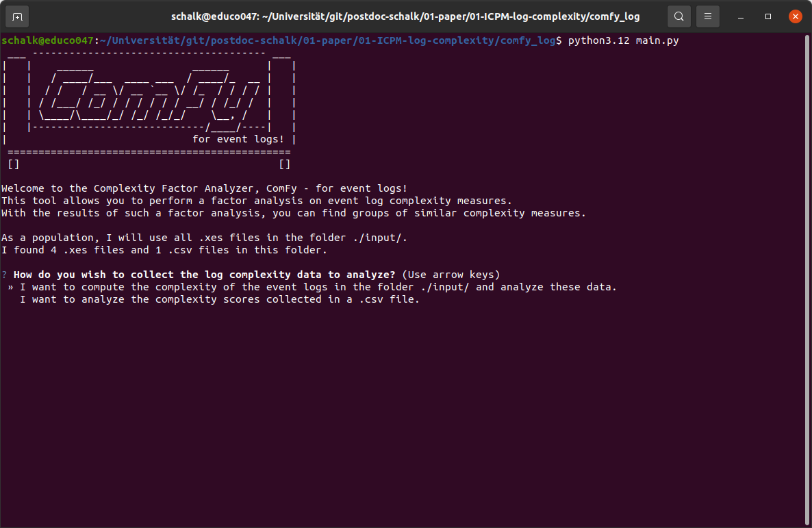
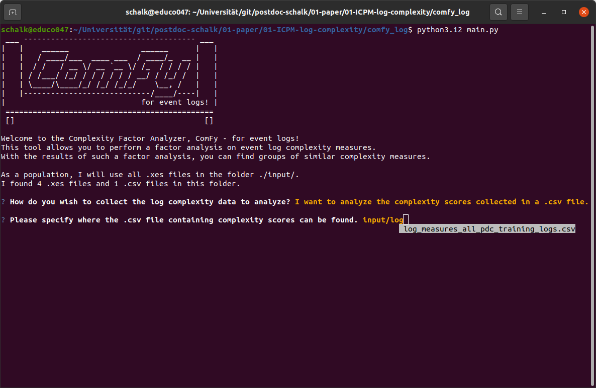
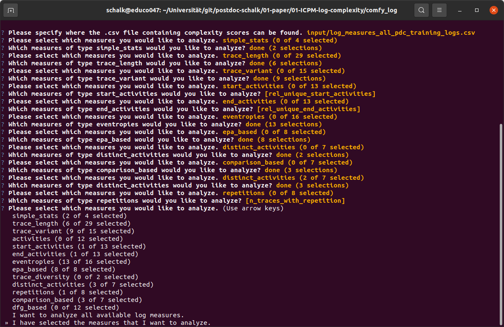
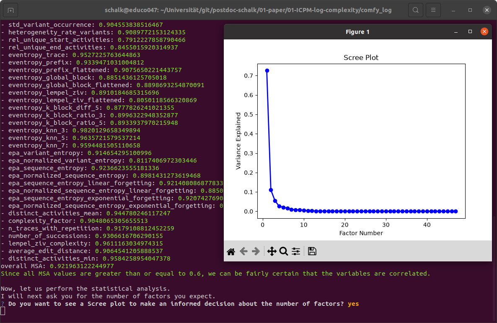
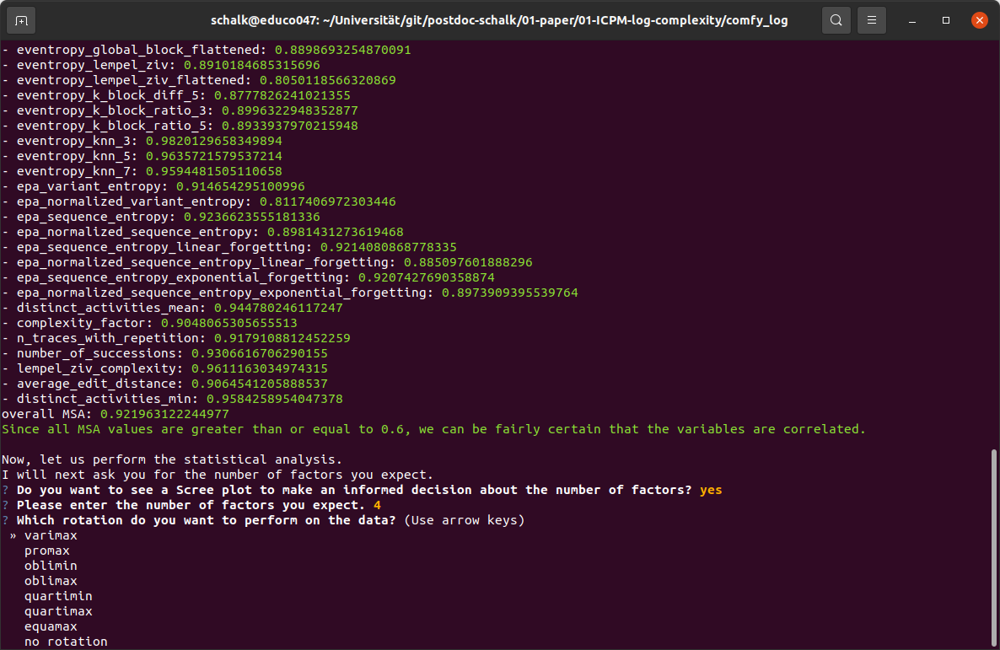
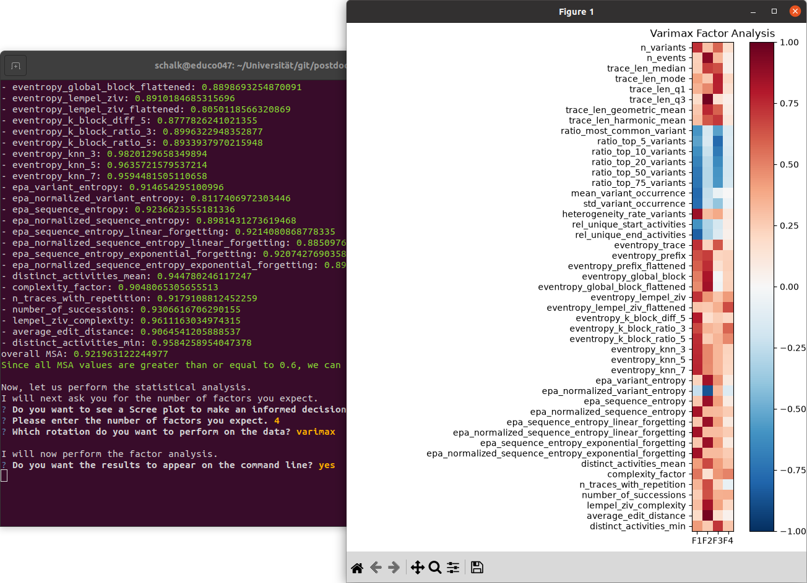
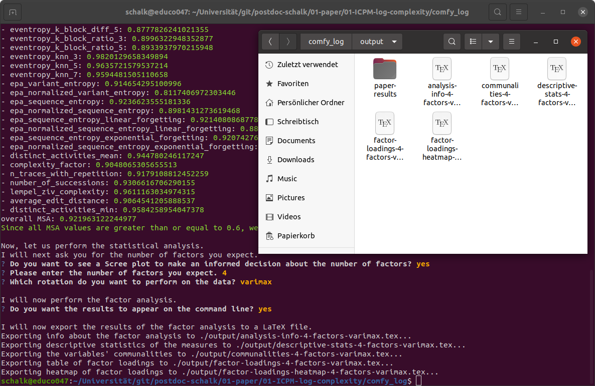

# ComFy for Log Measures

ComFy performs a factor analysis on complexity measures of event logs (e.g. from
process mining) to identify latent factors behind those measures. Given a CSV
file of per-log complexity scores, it runs Bartlett's test of sphericity and
the measure of sampling adequacy (MSA/KMO) to check whether a factor analysis
is appropriate, then performs the factor analysis itself and exports the
results as `.tex` tables into `output/`.

## Installation (from scratch)

This project pins an exact environment via conda/[Miniconda](https://docs.conda.io/en/latest/miniconda.html).

1. **Install conda**, if you don't already have it. Any distribution works
   (Miniconda, Anaconda, Miniforge). Verify it's on your `PATH`:

   ```bash
   conda --version
   ```

2. **Create the project's environment** from the repo root. This reads
   [`.conda.yml`](.conda.yml), which uses Python 3.14
   and every pip dependency (`pandas`, `questionary`, `factor-analyzer`,
   `feeed`, `scikit-learn`):

   ```bash
   conda env create -f .conda.yml
   ```

3. **Activate the environment** (needed in every new terminal session before
   running the script):

   ```bash
   conda activate comfy
   ```

4. **Run the analysis**:

   ```bash
   python test.py
   ```

   This expects an input CSV at `./input/log_measures_all_pdc_training_logs.csv`
   (one row per event log, one column per complexity measure). On success, it prints Bartlett's test and MSA diagnostics to the terminal and writes four
   `.tex` files to `output/`.

## Updating dependencies

Edit [`.conda.yml`](.conda.yml) and re-create the environment:

```bash
conda env remove -n comfy
conda env create -f .conda.yml
```

## Usage
Ensure that the `xes`-files or a `csv`-file containing the results of the log measures you want to analyze are in the folder `input`.
For example, you can use the trainings logs from the process discovery contest, found at (https://www.tf-pm.org/competitions-awards/discovery-contest).
Then, run the program by executing the following command:
```
python3.12 main.py
```
If the installation was successful, you will be greeted by the following sight:

You can use the arrow keys to navigate through the options and choose whether you want to analyze .xes files directly or import the results of log measures located in a .csv file.
If you choose the former, the tool will automatically go through all .xes files in the folder `input` and calculate the log measures based on their implementation in the FEEED library.
Choosing the latter lets you specify the location of the .csv file as shown in the following.

Afterward, you can choose which measures you want to analyze. 
If you imported a .csv file, only the measures mentioned in its header are available.
The available measures are grouped in the same way as the FEEED library, so you are not overwhelmed by the total amount of measures.

As soon as you are happy with your selection, choose the option `I have selected the measures that I want to analyze` and hit enter.
ComFy will then automatically start the analysis by performing two statistical tests:
- Bartlett's test of sphericity, described at (https://en.wikipedia.org/wiki/Bartlett's_test).
- Kaiser-Meyer-Olkin test, described at (https://en.wikipedia.org/wiki/Kaiser-Meyer-Olkin_test).
If one of these tests fails, you will be informed by the tool.
Otherwise, you will next be asked whether you want to perform a Scree test, as described in (https://en.wikipedia.org/wiki/Scree_plot).

Afterward, ComFy will prompt you to input the number of expected factors.
Finally, you can choose the rotation that you want to execute on the raw data to make it easier to interpret.

ComFy then executes the factor analysis with the specified parameters.
If desired, the program directly shows the factor loadings, descriptive statistics and the communalities by using the Python library `matplotlib`.

Regardless of the user's choice, ComFy will store the results of the factor analysis and the results of all previous tests in a LaTeX file in the folder `output`.
Furthermore, if the values of the log measures were extracted from .xes files, it stores the raw complexity data in a `csv`-file for later reference or further investigations.

To see the LaTeX files stored during the analysis of the paper *Cleaning Up the Measure Mess: A Factor Analysis on Event Log Measures*, you may navigate to the folder `paper-results` inside the folder `output`.

